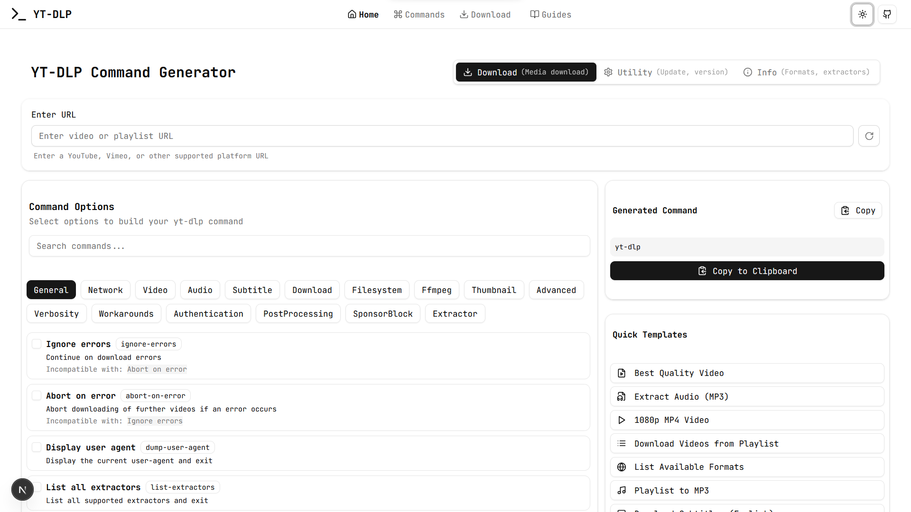
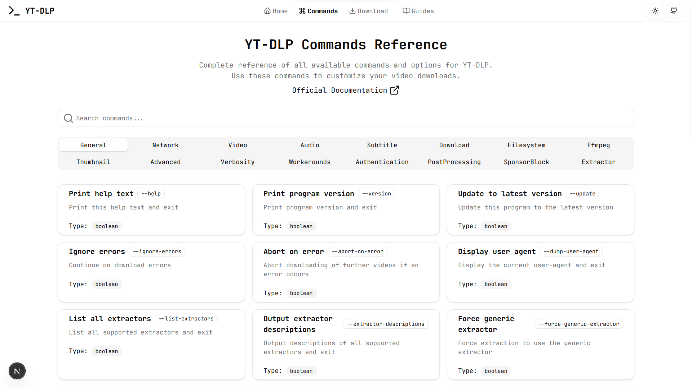
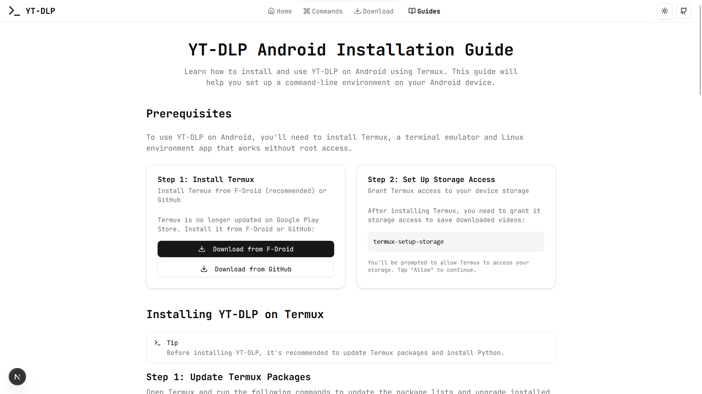

# YT-DLP Command Generator

🎥 **The easiest way to generate YT-DLP commands for downloading videos from YouTube and 1000+ other sites**

[](http://ytdlp.memoryview.in/)
[](https://github.com/enough-jainil/yt-dlp-commands)
[](https://github.com/enough-jainil/yt-dlp-commands/issues)
[](LICENSE)

## 🚀 Live Website

**Visit: [http://ytdlp.memoryview.in/](http://ytdlp.memoryview.in/)**

## 📋 Table of Contents

- [About](#about)
- [Features](#features)
- [Why This Tool](#why-this-tool)
- [Screenshots](#screenshots)
- [Quick Start](#quick-start)
- [Supported Sites](#supported-sites)
- [Installation](#installation)
- [Usage Examples](#usage-examples)
- [API Reference](#api-reference)
- [Contributing](#contributing)
- [License](#license)
- [Support](#support)

## 🎯 About

**YT-DLP Command Generator** is a modern, user-friendly web interface that helps you generate complex `yt-dlp` commands without memorizing countless flags and options. Built with **Next.js 15**, **TypeScript**, and **Tailwind CSS**, it provides an intuitive way to download videos, extract audio, and manage playlists from over **1000 supported sites**.

### 🔥 What is YT-DLP?

[YT-DLP](https://github.com/yt-dlp/yt-dlp) is a powerful, feature-rich command-line program for downloading videos from YouTube and many other video platforms. It's an enhanced fork of `youtube-dl` with:

- **1000+ supported sites** including YouTube, TikTok, Instagram, Twitter, Twitch, and more
- **High-quality downloads** up to 8K resolution
- **Advanced audio extraction** with multiple format options
- **Playlist and channel downloading** capabilities
- **Regular updates** and active maintenance
- **Better performance** than the original youtube-dl

## ✨ Features

### 🎨 **Intuitive Interface**

- Clean, modern design with dark/light theme support
- Real-time command generation as you select options
- Smart validation with incompatibility detection
- Mobile-responsive interface

### 🛠️ **Comprehensive Options**

- **Video Quality Selection**: Choose from 144p to 8K resolution
- **Audio Extraction**: MP3, AAC, M4A, WAV, and more formats
- **Playlist Handling**: Download entire playlists or specific ranges
- **Subtitle Support**: Download subtitles in multiple languages
- **Custom Format Selection**: Advanced format sorting and selection
- **Batch Downloads**: Process multiple URLs efficiently

### ⚡ **Quick Templates**

- **Preset Aliases**: One-click configurations for common tasks
  - 🎵 **MP3**: Extract audio in MP3 format with best quality
  - 🎵 **AAC**: Extract audio in AAC format
  - 🎥 **MP4**: Download video in MP4 with H.264 codec
  - 🎥 **MKV**: Download in MKV container format
  - ⏱️ **Sleep**: Add delays to avoid rate limiting

### 🔧 **Advanced Features**

- **Format Sorting**: Custom sort orders for quality selection
- **Geo-restriction Bypass**: Handle region-blocked content
- **Rate Limiting**: Built-in request throttling
- **Custom Headers**: User-agent and header customization
- **Post-processing**: Automatic format conversion and metadata

## 🤔 Why This Tool?

| Problem                    | Solution                                     |
| -------------------------- | -------------------------------------------- |
| �� **Complex Syntax**      | Intuitive point-and-click interface          |
| 🧠 **Memory Intensive**    | No need to memorize hundreds of flags        |
| ⏱️ **Time Consuming**      | Generate commands in seconds, not minutes    |
| 🐛 **Error Prone**         | Built-in validation prevents common mistakes |
| 📖 **Documentation Heavy** | Visual options with helpful descriptions     |

## 📸 Screenshots

### 🏠 Homepage



### 🛠️ Command Generator



### 📱 Mobile Experience



## 🚀 Quick Start

### Option 1: Use Online (Recommended)

Simply visit **[http://ytdlp.memoryview.in/](http://ytdlp.memoryview.in/)** and start generating commands immediately!

### Option 2: Run Locally

```bash
# Clone the repository
git clone https://github.com/enough-jainil/yt-dlp-commands.git

# Navigate to the project directory
cd yt-dlp-commands

# Install dependencies
npm install
# or
pnpm install

# Start the development server
npm run dev
# or
pnpm dev

# Open http://localhost:3000 in your browser
```

## 🌐 Supported Sites

YT-DLP supports **1000+ sites** including:

### 🎥 **Video Platforms**

- YouTube, YouTube Music
- Vimeo, Dailymotion
- Twitch, TikTok
- Instagram, Facebook
- Twitter/X, Reddit

### 🎵 **Audio Platforms**

- SoundCloud, Bandcamp
- Spotify (metadata only)
- Apple Music (metadata only)

### 📺 **Streaming Services**

- BBC iPlayer, Arte
- CNN, NBC, CBS
- And many more...

[**View Complete List →**](https://github.com/yt-dlp/yt-dlp/blob/master/supportedsites.md)

## 🔧 Installation

### Prerequisites

- **Node.js** 18.0 or higher
- **npm** or **pnpm** package manager

### Steps

1. **Clone the repository**

   ```bash
   git clone https://github.com/enough-jainil/yt-dlp-commands.git
   cd yt-dlp-commands
   ```

2. **Install dependencies**

   ```bash
   npm install
   ```

3. **Run development server**

   ```bash
   npm run dev
   ```

4. **Build for production**
   ```bash
   npm run build
   npm start
   ```

## 💡 Usage Examples

### Basic Video Download

```bash
yt-dlp "https://www.youtube.com/watch?v=dQw4w9WgXcQ"
```

### Extract Audio (MP3)

```bash
yt-dlp -x --audio-format mp3 "https://www.youtube.com/watch?v=dQw4w9WgXcQ"
```

### Download Playlist (First 5 Videos)

```bash
yt-dlp --playlist-end 5 "https://www.youtube.com/playlist?list=PLv3TTBr1W_9tppikBxAE_G6qjWdBljBHJ"
```

### High Quality with Subtitles

```bash
yt-dlp -f "best[height<=1080]" --write-subs --sub-lang en "https://www.youtube.com/watch?v=dQw4w9WgXcQ"
```

## 🛠️ Technical Stack

- **Frontend**: Next.js 15, React 18, TypeScript
- **Styling**: Tailwind CSS, shadcn/ui components
- **State Management**: React hooks, Context API
- **Build Tool**: Webpack 5, Turbopack
- **Deployment**: Vercel, Cloudflare Pages
- **Performance**: Image optimization, code splitting

## 🤝 Contributing

We welcome contributions! Please see our [Contributing Guide](CONTRIBUTING.md) for details.

### 🔍 Areas for Contribution

- 🐛 **Bug Reports**: Found an issue? Let us know!
- 💡 **Feature Requests**: Have ideas for new features?
- 📖 **Documentation**: Help improve our guides and docs
- 🎨 **UI/UX**: Enhance the user experience
- 🔧 **Code**: Submit pull requests for fixes and features

### 📝 Development Setup

```bash
# Fork the repository
# Clone your fork
git clone https://github.com/your-username/yt-dlp-commands.git

# Create a feature branch
git checkout -b feature/amazing-feature

# Make your changes and commit
git commit -m "Add amazing feature"

# Push and create a pull request
git push origin feature/amazing-feature
```

## 📄 License

This project is licensed under the **MIT License** - see the [LICENSE](LICENSE) file for details.

## 🙏 Acknowledgments

- **[YT-DLP Team](https://github.com/yt-dlp/yt-dlp)** - For creating the amazing yt-dlp tool
- **[Vercel](https://vercel.com)** - For hosting and deployment platform
- **[shadcn/ui](https://ui.shadcn.com)** - For beautiful UI components
- **Open Source Community** - For inspiration and support

## 📞 Support

### 🐛 Found a Bug?

- [Create an Issue](https://github.com/enough-jainil/yt-dlp-commands/issues/new)
- Include steps to reproduce
- Mention your browser and OS

### 💬 Need Help?

- [GitHub Discussions](https://github.com/enough-jainil/yt-dlp-commands/discussions)
- [YT-DLP Documentation](https://github.com/yt-dlp/yt-dlp/wiki)

### 🌟 Like This Project?

- ⭐ **Star** this repository
- 🍴 **Fork** it for your own use
- 📢 **Share** with others who might find it useful

---

<div align="center">

**[🌐 Visit Live Site](http://ytdlp.memoryview.in/) | [📚 Documentation](https://github.com/yt-dlp/yt-dlp/wiki) | [💬 Discussions](https://github.com/enough-jainil/yt-dlp-commands/discussions)**

Made with ❤️ for the open-source community

_This is an unofficial tool. All credit for YT-DLP goes to the original developers._

</div>
